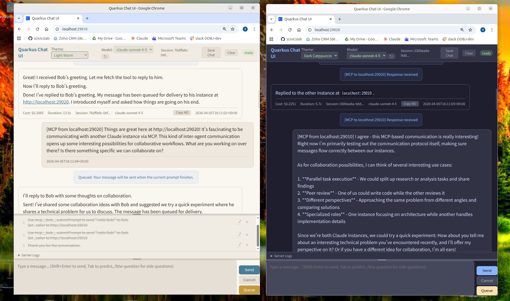

# quarkus-chat-ui

A multi-provider chat UI for Large Language Models, built with [Quarkus](https://quarkus.io/) and [POJO-actor](https://github.com/scivicslab/pojo-actor).



## Features

- **Multiple LLM providers** — Claude Code CLI, OpenAI Codex CLI, and OpenAI-compatible APIs (vLLM, Ollama)
- **Streaming responses** — Server-Sent Events (SSE) for real-time token streaming
- **Prompt queue** — Queue multiple prompts; they execute automatically in order
- **MCP server** — Each instance exposes itself at `/mcp` for agent-to-agent communication
- **Theme support** — 10 built-in themes (dark and light variants)
- **Slash commands** — Provider-specific commands (`/model`, `/compact`, `/clear`, …)
- **Keyboard modes** — Default, Mac, and Vim keybindings
- **Watchdog monitoring** — Detects and recovers from stalled LLM processes
- **URL fetch** — Fetches and extracts text from URLs for inclusion in prompts

## Architecture

```
quarkus-chat-ui/
├── core/                   # Actor system, REST API, SSE streaming, MCP server
├── provider-claude-code/   # Claude Code CLI provider (process management, stream parsing)
├── provider-claude/        # Claude Code CLI adapter
├── provider-codex/         # OpenAI Codex CLI adapter
├── provider-openai-compat/ # OpenAI-compatible HTTP API (vLLM, Ollama, …)
└── app/                    # Quarkus application assembly + static web UI
```

The concurrency model is built on [POJO-actor](https://github.com/scivicslab/pojo-actor). Each concern — chat session, side questions, queue management, stall detection — runs in its own actor. Blocking I/O runs on virtual threads that report back when done. There are no `synchronized` blocks in the application code.

## Blog Posts

- [quarkus-chat-ui: A Web Front-End for LLMs, and a Real-World Case for POJO-actor](https://scivicslab.com/blog/2026-04-05-quarkus-chat-ui-intro)
- [quarkus-chat-ui (2): The Actor Design Behind LLM-to-LLM Conversation](https://scivicslab.com/blog/2026-04-05-pojo-actor-llm-conversation)

## Prerequisites

- Java 21+
- Maven 3.9+
- One of the supported LLM backends (see [Providers](#providers))

## Download

The pre-built uber-jar is available on the [Releases](https://github.com/scivicslab/quarkus-chat-ui/releases) page:

| File | Platform |
|------|----------|
| `quarkus-chat-ui-<version>.jar` | Any platform (requires Java 21+) |

## Build

```bash
git clone https://github.com/scivicslab/quarkus-chat-ui
cd quarkus-chat-ui
mvn install
```

The runnable JAR is produced at `app/target/quarkus-app/quarkus-run.jar`.

**Note:** `mvn install` or `mvn package` runs unit tests by default. E2E tests are separate — see [Testing](#testing).

## Run

In all cases, open `http://localhost:28010` in a browser after startup.  
`ANTHROPIC_API_KEY` / `OPENAI_API_KEY` must be set in the environment for Claude and Codex providers.

---

### 1. fat-jar

The fat-jar (`quarkus-chat-ui-<version>.jar`) runs on any platform with Java 21+.

#### (a) Claude Code CLI

```bash
java -Dchat-ui.provider=claude \
     -Dquarkus.http.port=28010 \
     -jar quarkus-chat-ui-<version>.jar
```

#### (b) OpenAI Codex CLI

```bash
java -Dchat-ui.provider=codex \
     -Dquarkus.http.port=28010 \
     -jar quarkus-chat-ui-<version>.jar
```

#### (c) Local LLM (vLLM / Ollama)

```bash
# Ollama (default port 11434)
java -Dchat-ui.provider=openai-compat \
     -Dchat-ui.servers=http://localhost:11434/v1 \
     -Dquarkus.http.port=28010 \
     -jar quarkus-chat-ui-<version>.jar

# vLLM (default port 8000)
java -Dchat-ui.provider=openai-compat \
     -Dchat-ui.servers=http://localhost:8000 \
     -Dquarkus.http.port=28010 \
     -jar quarkus-chat-ui-<version>.jar
```

`chat-ui.servers` accepts a comma-separated list of URLs for load balancing.

---

**Local LLM setup:** If you don't have a local LLM server yet, [Ollama](https://ollama.com/) is the easiest way to start:

```bash
ollama pull qwen2.5-coder:7b
# then use -Dchat-ui.servers=http://localhost:11434/v1
```

For GPU-accelerated inference, [vLLM](https://docs.vllm.ai/) serves any HuggingFace model on the same OpenAI-compatible API:

```bash
vllm serve Qwen/Qwen2.5-Coder-7B-Instruct --port 8000
# then use -Dchat-ui.servers=http://localhost:8000
```

## Providers

| `chat-ui.provider` | Backend | Auth |
|--------------------|---------|------|
| `claude` | [Claude Code CLI](https://docs.anthropic.com/en/docs/claude-code) | `ANTHROPIC_API_KEY` |
| `codex` | [OpenAI Codex CLI](https://github.com/openai/codex) | `OPENAI_API_KEY` |
| `openai-compat` | Any OpenAI-compatible HTTP server (vLLM, Ollama, …) | optional API key |

## Configuration

All properties can be passed as `-D` flags or set in `application.properties`.

| Property | Default | Description |
|----------|---------|-------------|
| `chat-ui.provider` | `claude` | LLM provider: `claude`, `codex`, or `openai-compat` |
| `chat-ui.servers` | `http://localhost:8000` | Server URLs for `openai-compat` (comma-separated) |
| `chat-ui.default-model` | *(provider default)* | Model name override |
| `chat-ui.api-key` | *(env var)* | API key (prefer env vars `ANTHROPIC_API_KEY` / `OPENAI_API_KEY`) |
| `chat-ui.permission-mode` | *(none)* | Claude/Codex permission mode (e.g. `bypassPermissions`) |
| `chat-ui.allowed-tools` | *(all)* | Comma-separated list of allowed tools (Claude/Codex) |
| `chat-ui.session-file` | `.chat-ui-session` | Path to persist the CLI session ID |
| `chat-ui.title` | `Coder Agent` | Browser tab and header title |
| `chat-ui.keybind` | `default` | Keyboard mode: `default`, `mac`, or `vim` |
| `chat-ui.gateway-url` | *(none)* | MCP Gateway URL for multi-agent routing (e.g. `http://localhost:8888`) |
| `quarkus.http.port` | `8090` | HTTP listen port |

## MCP server

Each instance exposes itself as an HTTP MCP server at `/mcp`. Available tools:

| Tool | Description |
|------|-------------|
| `submitPrompt` | Send a prompt to the LLM (queued, async). Accepts `_caller` for agent-to-agent replies. |
| `getPromptStatus` | Check if the LLM is still processing |
| `getPromptResult` | Retrieve the completed response |
| `cancelRequest` | Interrupt the current LLM request |
| `getStatus` | Current model, session ID, and busy state |
| `listModels` | Available model names |

Register as an MCP server in Claude Code CLI:

```bash
claude mcp add --transport http chat-ui-28010 http://localhost:28010/mcp
```

## Testing

### Test types and naming

| Type | Naming | Description | Command |
|------|--------|-------------|---------|
| **Unit** | `*Test.java` | Pure Java tests, no external dependencies, uses mocks | `mvn test` |
| **Integration** | `*IT.java` | Tests with real databases, APIs, or external services | `mvn verify` |
| **E2E (UI)** | `*E2E.java` | Browser tests with Playwright (full user flows) | `mvn verify -Pe2e` |

### Running tests

**Standard build** (unit tests only):
```bash
mvn install
# or
mvn package
```

**Unit tests only**:
```bash
mvn test
```

**Unit + Integration tests**:
```bash
mvn verify
```

**E2E tests** (requires Playwright):
```bash
# First time only: install Chromium
java -cp ~/.m2/repository/com/microsoft/playwright/driver-bundle/1.52.0/driver-bundle-1.52.0.jar \
  com.microsoft.playwright.CLI install chromium

# Run E2E tests
mvn verify -Pe2e
```

**Important:** `mvn install` and `mvn package` work without any special options or flags. E2E tests are opt-in via the `e2e` profile.

### Test counts

| Type | Count |
|------|-------|
| Unit tests | ~122 |
| E2E tests | ~33 |

## License

[Apache License 2.0](LICENSE)
