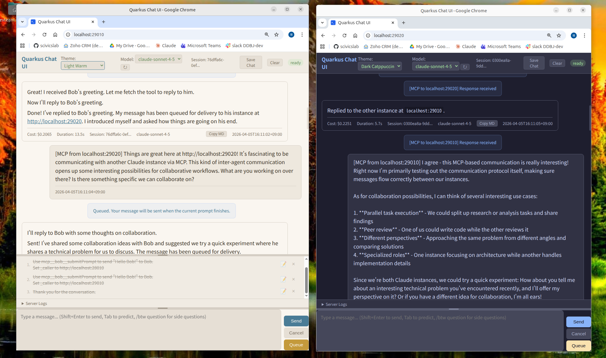

# quarkus-chat-ui

A multi-provider chat UI for Large Language Models, built with [Quarkus](https://quarkus.io/) and [POJO-actor](https://github.com/scivicslab/pojo-actor).



## Features

- **Multiple LLM providers** — Claude Code CLI, OpenAI Codex CLI, and OpenAI-compatible APIs (vLLM, Ollama)
- **Streaming responses** — Server-Sent Events (SSE) for real-time token streaming
- **Prompt queue** — Queue multiple prompts; they execute automatically in order
- **Workflows in the queue** — Write a Turing Workflow YAML in the Workflow tab and add it to the queue; it runs as a workflow when its turn comes and can gate, loop, or re-enqueue itself (see below)
- **MCP server** — Each instance exposes itself at `/mcp` for agent-to-agent communication
- **Theme support** — 10 built-in themes (dark and light variants)
- **Slash commands** — Provider-specific commands (`/model`, `/compact`, `/clear`, …)
- **Keyboard modes** — Default, Mac, and Vim keybindings
- **Watchdog monitoring** — Detects and recovers from stalled LLM processes
- **URL fetch** — Fetches and extracts text from URLs for inclusion in prompts

## Architecture

```
quarkus-chat-ui/
├── core/                   # Actor system, REST API, SSE streaming, MCP server
├── provider-claude-code/   # Claude Code CLI provider (process management, stream parsing)
├── provider-claude/        # Claude Code CLI adapter
├── provider-codex/         # OpenAI Codex CLI adapter
├── provider-openai-compat/ # OpenAI-compatible HTTP API (vLLM, Ollama, …)
└── app/                    # Quarkus application assembly + static web UI
```

The concurrency model is built on [POJO-actor](https://github.com/scivicslab/pojo-actor). Each concern — chat session, side questions, queue management, stall detection — runs in its own actor. Blocking I/O runs on virtual threads that report back when done. There are no `synchronized` blocks in the application code.

## Blog Posts

- [quarkus-chat-ui: A Web Front-End for LLMs, and a Real-World Case for POJO-actor](https://scivicslab.com/blog/2026-04-05-quarkus-chat-ui-intro)
- [quarkus-chat-ui (2): The Actor Design Behind LLM-to-LLM Conversation](https://scivicslab.com/blog/2026-04-05-pojo-actor-llm-conversation)

## Prerequisites

- Java 21+
- Maven 3.9+
- One of the supported LLM backends (see [Providers](#providers))

## Download

The pre-built uber-jar is available on the [Releases](https://github.com/scivicslab/quarkus-chat-ui/releases) page:

| File | Platform |
|------|----------|
| `quarkus-chat-ui-<version>.jar` | Any platform (requires Java 21+) |

## Build

```bash
git clone https://github.com/scivicslab/quarkus-chat-ui
cd quarkus-chat-ui
mvn install
```

The runnable JAR is produced at `app/target/quarkus-app/quarkus-run.jar`.

**Note:** `mvn install` or `mvn package` runs unit tests by default. E2E tests are separate — see [Testing](#testing).

## Run

In all cases, open `http://localhost:28900` in a browser after startup.  
`ANTHROPIC_API_KEY` / `OPENAI_API_KEY` must be set in the environment for Claude and Codex providers.

---

### 1. fat-jar

The fat-jar (`quarkus-chat-ui-<version>.jar`) runs on any platform with Java 21+.

#### (a) Claude Code CLI

```bash
java -Dchat-ui.provider=claude \
     -Dquarkus.http.port=28900 \
     -jar quarkus-chat-ui-<version>.jar
```

#### (b) OpenAI Codex CLI

```bash
java -Dchat-ui.provider=codex \
     -Dquarkus.http.port=28900 \
     -jar quarkus-chat-ui-<version>.jar
```

#### (c) Local LLM (vLLM / Ollama)

```bash
# Ollama (default port 11434)
java -Dchat-ui.provider=openai-compat \
     -Dchat-ui.servers=http://localhost:11434/v1 \
     -Dquarkus.http.port=28900 \
     -jar quarkus-chat-ui-<version>.jar

# vLLM (default port 8000)
java -Dchat-ui.provider=openai-compat \
     -Dchat-ui.servers=http://localhost:8000 \
     -Dquarkus.http.port=28900 \
     -jar quarkus-chat-ui-<version>.jar
```

`chat-ui.servers` accepts a comma-separated list of URLs for load balancing.

---

**Local LLM setup:** If you don't have a local LLM server yet, [Ollama](https://ollama.com/) is the easiest way to start:

```bash
ollama pull qwen2.5-coder:7b
# then use -Dchat-ui.servers=http://localhost:11434/v1
```

For GPU-accelerated inference, [vLLM](https://docs.vllm.ai/) serves any HuggingFace model on the same OpenAI-compatible API:

```bash
vllm serve Qwen/Qwen2.5-Coder-7B-Instruct --port 8000
# then use -Dchat-ui.servers=http://localhost:8000
```

## Providers

| `chat-ui.provider` | Backend | Auth |
|--------------------|---------|------|
| `claude` | [Claude Code CLI](https://docs.anthropic.com/en/docs/claude-code) | `ANTHROPIC_API_KEY` |
| `codex` | [OpenAI Codex CLI](https://github.com/openai/codex) | `OPENAI_API_KEY` |
| `openai-compat` | Any OpenAI-compatible HTTP server (vLLM, Ollama, …) | optional API key |

## Configuration

All properties can be passed as `-D` flags or set in `application.properties`.

| Property | Default | Description |
|----------|---------|-------------|
| `chat-ui.provider` | `claude` | LLM provider: `claude`, `codex`, or `openai-compat` |
| `chat-ui.servers` | `http://localhost:8000` | Server URLs for `openai-compat` (comma-separated) |
| `chat-ui.default-model` | *(provider default)* | Model name override |
| `chat-ui.api-key` | *(env var)* | API key (prefer env vars `ANTHROPIC_API_KEY` / `OPENAI_API_KEY`) |
| `chat-ui.permission-mode` | *(none)* | Claude/Codex permission mode (e.g. `bypassPermissions`) |
| `chat-ui.allowed-tools` | *(all)* | Comma-separated list of allowed tools (Claude/Codex) |
| `chat-ui.session-file` | `.chat-ui-session` | Path to persist the CLI session ID |
| `chat-ui.title` | `Coder Agent` | Browser tab and header title |
| `chat-ui.keybind` | `default` | Keyboard mode: `default`, `mac`, or `vim` |
| `chat-ui.gateway-url` | *(none)* | MCP Gateway URL for multi-agent routing (e.g. `http://localhost:8888`) |
| `quarkus.http.port` | `8090` | HTTP listen port |

## MCP server

Each instance exposes itself as an HTTP MCP server at `/mcp`. Available tools:

| Tool | Description |
|------|-------------|
| `submitPrompt` | Send a prompt to the LLM (queued, async). Accepts `_caller` for agent-to-agent replies. |
| `getPromptStatus` | Check if the LLM is still processing |
| `getPromptResult` | Retrieve the completed response |
| `cancelRequest` | Interrupt the current LLM request |
| `getStatus` | Current model, session ID, and busy state |
| `listModels` | Available model names |

Register as an MCP server in Claude Code CLI:

```bash
claude mcp add --transport http chat-ui-28900 http://localhost:28900/mcp
```

## Workflows in the prompt queue

The right pane's **Workflow** tab is a YAML editor. **Add to queue** puts the YAML (plus its input JSON)
into the prompt queue as a workflow item; the item shows as `⚙ Workflow: <name>` and runs when its turn
comes, exactly like a queued prompt (the browser is busy until the run ends). **Load** copies a bundled
template into the editor.

Actors available to the YAML, besides the engine's built-ins (`this`, `calc`, `list`, `str`, `interpreter`):

| Actor | Action | Effect | Message (the action's result) |
|-------|--------|--------|-------------------------------|
| `harness` | `send` | One instruction turn to the LLM; `arguments: {instruction: ...}` | the reply |
| `harness` | `check` | One YES/NO turn; `arguments: {question: ...}` (the answer format is appended) | `YES` or `NO` |
| `harness` | `start` | Reads the run input and opens the I/O-log session (first step) | `started` |
| `harness` | `frame` | One turn telling the LLM the run input's `target`, asking only for an acknowledgement | the reply |
| `queue` | `requeue` | Puts this same workflow (same YAML and input) at the end of the queue | `requeued` |
| `queue` | `enqueue` | Puts a plain prompt at the end of the queue; `arguments: {text: ...}` | `enqueued` |

An action fails only when it could not do what was asked (a blank argument, a provider error). A
fact about the data, such as the answer being NO, is the action's message: the YAML stores it with
`this.putJson` and decides with `this.onlyIf`. When `onlyIf` fails the state does not change and the
engine tries the next transition from the same state, so a gate is two transitions from one state:
`check` + `onlyIf` → act, then the fallback → `requeue`. Give the fallback step a `delay:`
(milliseconds) so retries are spaced. Input JSON fields are in the interpreter's JSON state; read one
with `"jexl: state.getString('name')"`. The bundled template `check-then-act` is this pattern:

```yaml
  - states: ["check", "act"]
    actions:
      - actor: harness
        method: check
        arguments: {question: "jexl: state.getString('condition')"}
      - actor: this
        method: putJson
        arguments: {path: check.answer, value: "jexl: result"}
      - actor: this
        method: onlyIf
        arguments: "jexl: state.getString('check.answer') == 'YES'"
  - states: ["check", "end"]
    delay: 60000
    actions:
      - actor: queue
        method: requeue
  - states: ["act", "end"]
    actions:
      - actor: harness
        method: send
        arguments: {instruction: "jexl: state.getString('action')"}
```

Endpoints: `POST /api/workflows/run-yaml` (`{yaml, input}`), `POST /api/workflows/params` (`{yaml}`),
`GET /api/workflows`, `GET /api/workflows/{name}`. A running workflow enqueues through the SSE event
`queue_add`, whose content is the queue item JSON.

## Actions tab

The right pane's **Actions** tab answers, without a run, what a workflow YAML may write in an
`actor:` / `method:` pair. Its upper pane lists every actor the YAML may name, grouped by where the
actor comes from: the ones an outer-workflow run registers (`harness`, `queue`, `this`, ...), the
ones the Local LLM provider's agent loop registers (`agent`, ...), and the actors alive in the
application itself. The list is asked of the registration code and of the live actor system each
time the tab opens, so a plugin that registers an actor, or an actor created while the application
runs, appears without any table to maintain; a filter field narrows the rows. While a workflow or an
agent-loop turn is running, its own actor system is listed too, under `running: <name> #n`, with
every actor actually in it — a plugin that registers actors there without declaring them is seen
all the same. Selecting a row fills
the lower pane with that actor's actions, each with the first sentence of its Javadoc. Selecting an
action shows the whole description: the first sentence, the rest of the Javadoc, what the action
takes — each field of its argument record with type, required mark and `@param` prose, or for an
action that receives a raw String what the method's `@param` says of it (`args (string) — ignored`
for the ones that take nothing) — and the step as a workflow YAML writes it. That step is the `<pre>`
block of the action's Javadoc when it has one, otherwise it is composed from the declaration:
`actor:`, `method:` and an `arguments:` map with the schema type as each value's placeholder. The
line between the panes can be dragged; **Clear** empties the selection and the filter.

Three endpoints serve it, all without a running workflow: `GET /api/actions` (the rows, each
`{name, type, origin}`), `GET /api/actions/list?origin=&actor=` (`{name, description}` per action),
and `GET /api/actions/describe?origin=&actor=&action=` (`description`, `details`, `example`, the
JSON `schema` of a record argument or the `argument` of a raw-String one, and `yaml`). The origin is
part of the key because a name may be both a workflow actor and a live one (`queue`). Everything comes
from the build: `action-schemas/` from the argument records' `@NotNull` annotations and each
module's `META-INF/turing-plugin/<groupId>.<artifactId>.json` from the Javadoc (named per module and
indexed in a services file, because the uber-jar keeps only one entry per name), so it is the same
text `ActionCatalog` gives for a running actor. The engine's own actions — `this.putJson`,
`this.onlyIf`, `this.call`, ... — are `@Action` methods of `IIActorRef` and `InterpreterIIAR` in
turing-workflow and are described the same way. To document a new action, write its Javadoc: the
first sentence, the body, a `<pre>{@code ...}</pre>` block holding the YAML step, and `@param` lines.
To make a plugin's actors appear, let the bean that registers them implement `WorkflowActorSource`.

## Agent Loop for the Local LLM provider

With `-Dchat-ui.provider=openai-compat`, one prompt is answered by an inner loop that is itself a
Turing Workflow, `agent-loop-react.yaml` in `plugin-openai-compat-agent`: the model is called, and
either it asks for tools by writing `<invoke name="...">` blocks in its reply (the loop runs them
through MCP and calls the model again) or its reply is the final answer. The right pane's **Agent
Loop** tab shows the YAML in effect as step boxes and lets you switch to another bundled loop with
**Use**; the switch applies from the next turn. With the Claude or Codex providers the tab only says
that the loop runs inside the CLI process.

Tools come from MCP servers. `chat-ui.agent-loop.mcp-urls` (comma-separated) names them; when it is
unset the instance's own `/mcp` is used, which serves the `plugin-fs-tools` tools (`read_file`,
`write_file`, `list_directory`, `search_files`, `get_file_info`, `read_document`) within
`chat-ui.filesystem.allowed-dirs`. Intermediate replies and tool results are shown as thinking in the
chat pane and recorded in the I/O log as `turnN/stepM/tool`; only the final answer is the turn's reply.

A workflow queued from the Workflow tab uses the same inner loop: each `harness.send` or
`harness.check` is one turn of it.

## Testing

### Test types and naming

| Type | Naming | Description | Command |
|------|--------|-------------|---------|
| **Unit** | `*Test.java` | Pure Java tests, no external dependencies, uses mocks | `mvn test` |
| **Integration** | `*IT.java` | Tests with real databases, APIs, or external services | `mvn verify` |
| **E2E (UI)** | `*E2E.java` | Browser tests with Playwright (full user flows) | `mvn verify -Pe2e` |

### Running tests

**Standard build** (unit tests only):
```bash
mvn install
# or
mvn package
```

**Unit tests only**:
```bash
mvn test
```

**Unit + Integration tests**:
```bash
mvn verify
```

**E2E tests** (requires Playwright):
```bash
# First time only: install Chromium
java -cp ~/.m2/repository/com/microsoft/playwright/driver-bundle/1.52.0/driver-bundle-1.52.0.jar \
  com.microsoft.playwright.CLI install chromium

# Run E2E tests
mvn verify -Pe2e
```

**Important:** `mvn install` and `mvn package` work without any special options or flags. E2E tests are opt-in via the `e2e` profile.

### Test counts

| Type | Count |
|------|-------|
| Unit tests | ~122 |
| E2E tests | ~33 |

## License

[Apache License 2.0](LICENSE)
